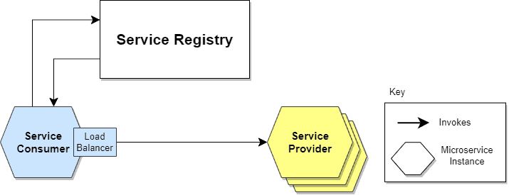

# Service Discovery:

- Service Discovery helps by providing a database of available service instances so that services can be discovered, registered, and de-registered based on usage.
- Service Discovery in microservices manages the dynamically changing locations of service instances and their communication. It ensures that actual service requests are routed to instances working at a given time and helps maintain the architecture's robust and responsive nature.

### what is the need of service discovery?
- To communicate from one service to another, we need to know it's network path(hostname/IP + Port).
- If we hard-code the urls in properties files, then any changes on urls need a code update, rebuild and redeploy needed
- When we deploy microservices in the cloud we always get dynamic urls
- Horizontal Autoscaling: To meet the peek loads auto-scaling of microservices are needed then how do we maintain these service urls? 
- Load Balancing: if same microservice deployed on 10 instances, then which url to use?
- Multiple Environments: managing service urls per environment will become difficult.
- Release of a new version will change the urls of the application
- One solution that solves all above problems that is Service Discovery.

## Service Discovery Mechanism:
- A microservices-based application typically runs in virtualized or containerized environments. The number of instances of a service and its locations changes dynamically.
- A microservice needs to know the location (IP address and port) of every service it communicates with.
- The Service Discovery mechanism helps us know where each instance is located. In this way, a Service Discovery component acts as a registry in which the addresses of all instances are tracked.
- Service Discovery Mechanism divided into 2 parts:

1. Service Registry
2. Service Discovery
___
___

### Service Registry:
- It’s a database containing the network locations of service instances.
- A Service Registry must be highly available and up to date.
- A Service Registry consists of a cluster of servers that use a replication protocol to maintain consistency.
- Clients can cache the network paths obtained from the Service Registry; however, this information eventually becomes obsolete.

#### 1. Self Registration:
- When using the self-registration model, a service instance is responsible for registering and de-registering itself in the Service Registry. 
- In addition, if necessary, a service instance sends heartbeat requests to keep its registration alive.

- One advantage is that it’s relatively simple and doesn’t require other system components as intermediaries.
-  a significant disadvantage is that it couples service instances to the Service Registry, which means we must implement the registration code in each language and framework used.

#### 2. Third-Party Registration:
- In this model the service instances aren’t responsible for registration in the Service Registry. 
- Instead, another system component known as the Service Register is responsible for registration. 
- The Service Register keeps track of changes to running instances by polling the deployment environment or subscribing to events.
- When it detects a newly available service instance, it records it in its database. 
- The Service Registry also de-registers terminated service instances.

- One of the main advantages is that services are decoupled from the Service Registry. 
- There’s no need to implement service registration logic for each programming language and framework.
- Instead, the registration of service instances is managed centrally within a dedicated service
- One disadvantage of this model is that, unless it’s embedded in the deployment environment, it’s yet another highly available system component that needs to be set up and managed.

___
___

### Service Discovery Patterns:

#### 1. Client-Side Service Discovery Pattern:

- When using Client-Side Discovery, the Service Consumer is responsible for determining the network locations of available service instances and load balancing requests between them. 
- The client lookup for service in service registry. Then the client uses a load-balancing algorithm to choose one of the available service instances and performs a request.

- Giving responsibility for client-side load balancing is both a burden and an advantage. It’s an advantage because it saves an extra hop that we would’ve had with a dedicated load balancer. It’s a disadvantage because the Service Consumer must implement the load balancing logic.

- We can also point out that the Service Consumer and the Service Registry are quite coupled. This means that Client-Side Discovery logic must be implemented for each programming language and framework used by the Service Consumers.

#### 2. Server-Side Service Discovery Pattern:
-  Server-Side Discovery model, which uses an intermediary that acts as a Load Balancer. The client makes a request to a service via a load balancer that acts as an orchestrator. 
- The load balancer queries the Service Registry and routes each request to an available service instance.

- This is the main advantage of this approach. Indeed, creating this level of abstraction makes the Service Consumer lighter, as it doesn’t have to deal with the lookup procedure. As a matter of fact, there’s no need to implement the discovery logic separately for each language and framework that the Service Consumer uses.

- On the other hand, we must set up and manage the Load Balancer, unless it’s already provided in the deployment environment.

___
___

### How Service Discovery Works

Here’s a step-by-step breakdown of how Service discovery works:

__1. Service Registration:__

    - The moment when a new service process is started, it registers itself in a service registry.
    - The registration process includes data such as the service's network location (IP address, port), name, metadata, and health status.

__2. Service Registry:__

    - The service registry acts like a centralized or distributed database containing information about running services and their locations.
    - The service registry acts as a directory where services publish information about the availability, and other services can query this information.

__3. Service Lookup:__

    - Whenever one service needs to communicate with another, it sends a request to the service registry, looking for the location of the particular service.
    - This lookup could be done using various methods such as HTTP requests, DNS queries, or specialized protocols.

__4. Load Balancing:__

    - Load balancing helps distribute incoming requests among multiple instances of the same service.
    - Load balancers can be utilized with the service registry to provide dynamic routes for traffic to healthy instances.

__5. Dynamic Updates:__

    - Service discovery systems support updates to the registry.
    - When components are unavailable (e.g., a crash or maintenance), it deregisters itself from the registry.

__6. Health Checking:__

    - Service discovery systems typically consist of health probes that verify the state of service instances and respond to their health status.
    - By default, the registry would remove any sick instance from the list of available services; thus, only healthy instances are seen by clients.

These steps help with service discovery, which enables service interchangeability and communication among the services supporting the distributed system.

___
___

#### How to implement Service Discovery with Spring Boot?
- Follow here: https://spring.io/guides/gs/service-registration-and-discovery

#### how to do client-side Discovery and Load balancing?
- Follow here: https://spring.io/guides/gs/spring-cloud-loadbalancer
- Clientside Discovery + RestTemplate/RestClient/WebClient as a load balancer: https://docs.spring.io/spring-cloud-commons/reference/spring-cloud-commons/common-abstractions.html

#### How to do Server-Side Discovery + Load Balancing?
- Serverside Discovery + load balancing: https://www.baeldung.com/zuul-load-balancing

- @EnableDiscoveryClient is no longer required. You can put a DiscoveryClient implementation on the classpath to cause the Spring Boot application to register with the service discovery server.

#### References: 

__Service Discovery:__
1. https://microservices.io/tags/service%20discovery
2. https://www.baeldung.com/cs/service-discovery-microservices
3. https://edgedelta.com/company/blog/what-is-service-discovery
4. https://spring.io/guides/gs/service-registration-and-discovery
5. Eureka Server + Client Configs:https://docs.spring.io/spring-cloud-netflix/reference/spring-cloud-netflix.html#spring-cloud-eureka-server

__Load Balancing:__
1. How Load Balancer Works?: https://www.baeldung.com/cs/load-balancer
2. Spring cloud load balancer: https://docs.spring.io/spring-cloud-commons/reference/spring-cloud-commons/loadbalancer.html
3. Load Balancers start guide: https://spring.io/guides/gs/spring-cloud-loadbalancer
4. Clientside Discovery + WebClient as a load balancer: https://docs.spring.io/spring-cloud-commons/reference/spring-cloud-commons/common-abstractions.html#webclinet-loadbalancer-client
5. Serverside Discovery + load balancing: https://www.baeldung.com/zuul-load-balancing

__Netflix Ribbon:__
1. https://www.baeldung.com/spring-cloud-rest-client-with-netflix-ribbon
